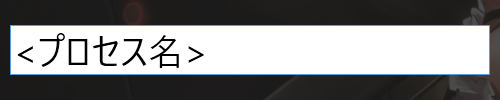
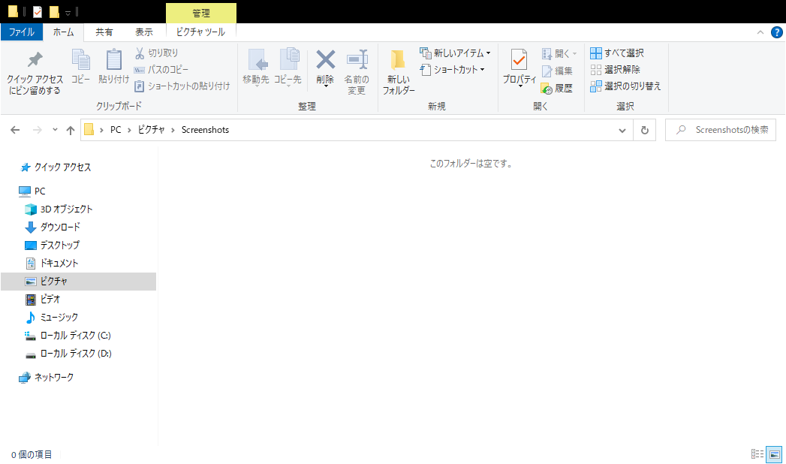
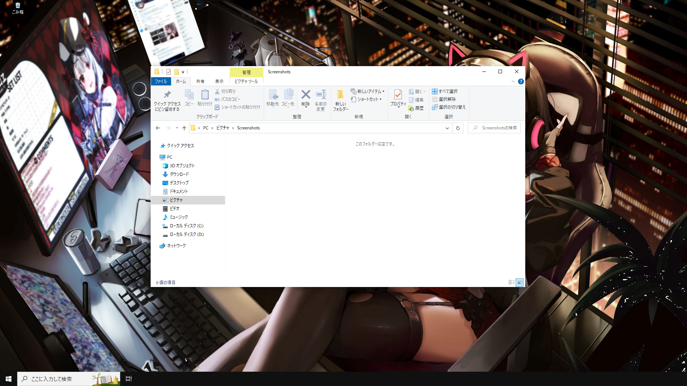

# QuickLauncher

Windows用クイックランチャーです

スクリーンショット機能もあります

# DEMO

Ctrl + Shift + Enter で起動し、任意の文字列を入力すると設定されたプロセスが実行されます

Alt + S でアクティブ状態のウィンドウのスクリーンショットを保存します

Ctrl + Alt + S で全画面のスクリーンショットを保存します

# Usage

下記URL、最新リリースの「QuickLauncher_ver.x.x.x.zip」をダウンロード、解凍し中の.exeファイルが実行ファイルです

[Release](https://github.com/SHHIKA/QuickLauncher/releases) 

# Author

* SHIKA
* [Twitter](https://twitter.com/skym_engProg)
